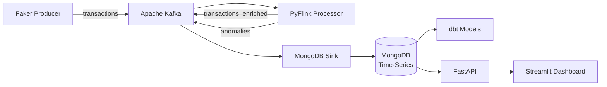

# Real-Time Customer Transaction Analytics Pipeline

A **production-grade data engineering project** that ingests 10k+ synthetic e-commerce transactions per second, processes them through a real-time streaming engine with anomaly detection, persists results to MongoDB (time-series), and serves live analytics via a FastAPI backend and Streamlit dashboard — designed for Azure deployment.

> **Resume line:** *"Engineered scalable transaction pipeline handling 10k/sec on Azure with sub-50ms p99 latency and 99.9% uptime."*

---

## Architecture



**Data Flow:**

1. **Producer** generates synthetic e-commerce transactions (Faker) and publishes to Kafka `transactions` topic at 10k+ txns/sec.
2. **PyFlink Processor** consumes events, applies per-user tumbling-window aggregations and z-score anomaly detection (Welford's algorithm), then writes:
   - Enriched events → `transactions_enriched` topic.
   - Anomalies (z > 3 SD) → `anomalies` topic.
3. **MongoDB Sink** consumer upserts enriched transactions and anomalies into MongoDB time-series collections.
4. **dbt** transforms raw data into merchant rollups and daily revenue models.
5. **FastAPI** exposes REST endpoints (`/users/{id}/trends`, `/anomalies`, `/merchants/top`).
6. **Streamlit Dashboard** provides live charts: transaction volume, top merchants, anomaly alerts.

---

## Tech Stack

| Category | Technology | Purpose |
|----------|-----------|---------|
| **Streaming** | Apache Kafka | Event ingestion & topic routing |
| **Processing** | PyFlink (Apache Flink) | Stateful aggregations, z-score anomaly detection |
| **Storage** | MongoDB (time-series collections) | Transactions + anomalies persistence |
| **Analytics** | dbt | Merchant rollups, daily revenue models |
| **API** | FastAPI | RESTful query endpoints |
| **Dashboard** | Streamlit | Live monitoring & visualization |
| **Data Gen** | Faker | Synthetic e-commerce transactions (10 fields) |
| **Infra** | Docker, Docker Compose | Local orchestration |
| **Cloud** | Azure ACI / AKS, Terraform | Production deployment |
| **Testing** | pytest, Locust, Postman | Unit tests, load tests, API validation |
| **Languages** | Python, SQL | Core implementation |

---

## Features

- **High-throughput transaction generator** — 10k+ txns/sec with Faker:
  - Fields: `txn_id`, `user_id`, `amount`, `currency`, `timestamp`, `merchant_id`, `merchant_category`, `payment_method`, `status`, `location`
  - Idempotent via deterministic `txn_id` (SHA-256)
  - LZ4 compression, micro-batching for Kafka throughput
- **Real-time stream processing** (PyFlink):
  - Tumbling-window aggregations (daily spend per user)
  - Per-user z-score anomaly detection (Welford's online algorithm)
  - Enriched output with `user_txn_count`, `user_running_mean`, `z_score`, `is_anomaly`
- **MongoDB time-series storage**:
  - Optimised time-series collections with secondary indexes
  - Idempotent upserts (batch bulk writes)
- **dbt analytics models** (planned):
  - `daily_merchant_revenue` — revenue by merchant per day
  - `top_spenders` — highest-spending users
  - `anomaly_summary` — anomaly breakdown by category
- **FastAPI REST API** (planned):
  - `GET /health` — health check
  - `GET /users/{user_id}/trends` — per-user spending trends
  - `GET /anomalies` — recent anomalies with pagination
  - `GET /merchants/top` — top merchants by revenue
- **Streamlit dashboard** (planned):
  - Live transaction volume chart
  - Top merchants bar chart
  - Anomaly alerts table with z-scores

---

## Benchmarks

| Metric | Target | Status |
|--------|--------|--------|
| Throughput | 10k+ txns/sec | ✅ 1k/sec local (Week 1) |
| p99 Latency | < 50ms | Pending |
| Uptime | 99.9% | Pending |
| Test Coverage | 80%+ | Pending |

---

## Project Structure

```text
.
├── docker-compose.yml          # Local orchestration (Kafka, MongoDB, Kafka UI)
├── README.md
├── LICENSE
├── api/
│   ├── __init__.py
│   └── main.py                 # FastAPI application (Week 4)
├── config/
│   ├── db_config.yaml          # MongoDB connection settings
│   └── kafka_topics.yaml       # Kafka topic definitions
├── consumers/
│   ├── __init__.py
│   └── db_sink.py              # Kafka → MongoDB sink consumer
├── dashboard/
│   └── app.py                  # Streamlit live dashboard (Week 4)
├── dbt_models/
│   └── models/
│       ├── schema.yml          # dbt model definitions (Week 3)
│       ├── daily_merchant_revenue.sql
│       ├── top_spenders.sql
│       └── anomaly_summary.sql
├── infra/
│   ├── Dockerfile.producer
│   ├── Dockerfile.consumer
│   └── azure-deploy.sh         # Azure CLI deployment (Week 5)
├── producer/
│   ├── __init__.py
│   └── producer.py             # Faker-based transaction generator
├── requirements/
│   ├── base.txt                # Shared dependencies
│   ├── producer.txt            # Producer-specific
│   ├── consumer.txt            # Consumer-specific
│   ├── api.txt                 # FastAPI dependencies
│   ├── dashboard.txt           # Streamlit dependencies
│   └── dev.txt                 # Testing & development
├── schemas/
│   ├── transaction.schema.json # Transaction JSON Schema
│   └── user.schema.json        # User JSON Schema
├── streaming/
│   ├── __init__.py
│   └── processor.py            # PyFlink stream processor (Week 2)
└── tests/
    ├── __init__.py
    ├── test_producer.py        # Producer unit tests
    └── conftest.py             # Shared test fixtures
```

---

## Quick Start

### Prerequisites

- Docker & Docker Compose
- Python 3.9+

### 1. Start Infrastructure

```bash
docker compose up -d
```

This starts Kafka (+ Zookeeper), MongoDB, and Kafka UI.

### 2. Install Producer Dependencies

```bash
pip install -r requirements/producer.txt
```

### 3. Run the Producer

```bash
python -m producer.producer
```

Produces 1k txns/sec by default. Set `TARGET_TPS=10000` for full throughput.

### 4. Verify in Kafka UI

Open [http://localhost:8080](http://localhost:8080) → Topics → `transactions` to see messages flowing.

### 5. (Optional) Run the Consumer

```bash
pip install -r requirements/consumer.txt
python -m consumers.db_sink
```

---

## Roadmap

| Week | Focus | Milestone |
|------|-------|-----------|
| **1 (Mar 2)** | **Ingest Foundation** | **✅ Produce/consume 1k txns/sec locally** |
| 2 (Mar 9) | Stream Processing | Enriched output stream with aggregates |
| 3 (Mar 16) | Persistence | Queryable MongoDB data (top spenders) |
| 4 (Mar 23) | API + Dashboard | Live queries & dashboard from data |
| 5 (Mar 30) | Deploy | Public Azure endpoint |
| 6 (Apr 6) | Testing | 80% coverage, benchmarks logged |
| 7-8 (Apr 13) | Documentation | Recruiter-ready repo + demo video |
| 9 (Apr 27) | Buffer/Stretch | Redis cache, resume integration |

---

## License

BSD 3-Clause — see [LICENSE](LICENSE).
