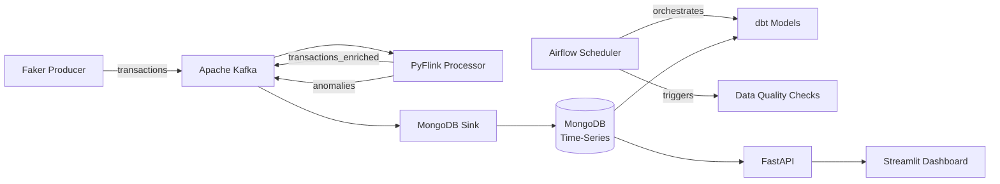

# Real-Time Customer Transaction Analytics Pipeline

Built to demonstrate end-to-end data engineering: real-time streaming, batch orchestration, and analytics serving.

A **production-grade data engineering project** that ingests synthetic e-commerce transactions (designed for 10k+ txns/sec), processes them through a real-time streaming engine with anomaly detection, and persists results to MongoDB (time-series) — designed for Azure deployment.

---

## Architecture



**Data Flow:**

1. **Producer** generates synthetic e-commerce transactions (Faker) and publishes to Kafka `transactions` topic (designed for 10k+ txns/sec).
2. **PyFlink Processor** consumes events, applies per-user tumbling-window aggregations and z-score anomaly detection (Welford's algorithm), then writes:
   - Enriched events → `transactions_enriched` topic.
   - Anomalies (z > 3 SD) → `anomalies` topic.
3. **MongoDB Sink** consumer upserts enriched transactions and anomalies into MongoDB time-series collections.
4. **Airflow** orchestrates scheduled batch workloads — dbt model runs, data quality checks, and MongoDB maintenance tasks.
5. **dbt** transforms raw data into merchant rollups and daily revenue models.
6. **FastAPI** exposes REST endpoints (`/users/{id}/trends`, `/anomalies`, `/merchants/top`).
7. **Streamlit Dashboard** provides live charts: transaction volume, top merchants, anomaly alerts.

> **Status:** Core streaming pipeline (steps 1–3), REST API (step 6), and live dashboard (step 7) are complete and functional. Orchestration and batch models are in active development.

---

## Tech Stack

| Category | Technology | Purpose |
|----------|-----------|---------|
| **Streaming** | Apache Kafka | Event ingestion & topic routing |
| **Processing** | PyFlink (Apache Flink) | Stateful aggregations, z-score anomaly detection |
| **Storage** | MongoDB (time-series collections) | Transactions + anomalies persistence |
| **Orchestration** | Apache Airflow | Scheduled DAGs for dbt, data quality, maintenance |
| **Analytics** | dbt | Merchant rollups, daily revenue models |
| **API** | FastAPI | RESTful query endpoints |
| **Dashboard** | Streamlit | Live monitoring & visualization |
| **Data Gen** | Faker | Synthetic e-commerce transactions (10 fields) |
| **Infra** | Docker, Docker Compose | Local orchestration |
| **Cloud** | Azure ACI / AKS, Terraform | Production deployment |
| **Testing** | pytest, Locust, Postman | Unit tests, load tests, API validation |
| **Languages** | Python, SQL | Core implementation |

---

## Features

- **High-throughput transaction generator** — 10k+ txns/sec with Faker:
  - Fields: `txn_id`, `user_id`, `amount`, `currency`, `timestamp`, `merchant_id`, `merchant_category`, `payment_method`, `status`, `location`
  - Idempotent via deterministic `txn_id` (SHA-256)
  - LZ4 compression, micro-batching for Kafka throughput
- **Real-time stream processing** (PyFlink):
  - Tumbling-window aggregations (daily spend per user)
  - Per-user z-score anomaly detection (Welford's online algorithm)
  - Enriched output with `user_txn_count`, `user_running_mean`, `z_score`, `is_anomaly`
- **MongoDB time-series storage**:
  - Optimised time-series collections with secondary indexes
  - Idempotent upserts (batch bulk writes)
- **FastAPI REST API**:
  - `/users/{id}/trends` — per-user spending trends with aggregated stats, top categories
  - `/anomalies` — recent anomaly alerts, filterable by user/z-score
  - `/merchants/top` — top merchants ranked by revenue
  - `/health` — liveness probe, `/docs` — interactive Swagger UI
  - Pydantic response models, CORS middleware
- **Streamlit Dashboard**:
  - KPI summary cards (total txns, revenue, avg amount, anomaly count)
  - Hourly transaction volume area chart
  - Top merchants by revenue (horizontal bar chart, colour-coded by category)
  - Spend breakdown by category (donut chart)
  - Transaction status distribution (donut chart)
  - Recent anomaly alerts table with z-score
  - Configurable lookback period, auto-refresh (30 s)

---

## Benchmarks

| Metric | Target | Status |
|--------|--------|--------|
| Throughput | 10k+ txns/sec | ✅ 1k/sec local |

---

<details>
<summary>Project Structure</summary>

```text
.
├── docker-compose.yml          # Local orchestration (Kafka, MongoDB, Kafka UI, API)
├── README.md
├── LICENSE
├── airflow/ (planned)
├── api/
│   ├── __init__.py
│   └── main.py                 # FastAPI application
├── config/
│   ├── db_config.yaml          # MongoDB connection settings
│   └── kafka_topics.yaml       # Kafka topic definitions
├── consumers/
│   ├── __init__.py
│   └── db_sink.py              # Kafka → MongoDB sink consumer
├── dashboard/
│   └── app.py                  # Streamlit live dashboard
├── dbt_models/
│   └── models/                 # dbt transforms (planned)
├── infra/
│   ├── Dockerfile.api          # API container
│   ├── Dockerfile.producer     # Producer container
│   └── Dockerfile.consumer     # Consumer container
├── producer/
│   ├── __init__.py
│   └── producer.py             # Faker-based transaction generator
├── requirements/
│   ├── base.txt                # Shared dependencies
│   ├── producer.txt            # Producer-specific
│   ├── consumer.txt            # Consumer-specific
│   ├── api.txt                 # FastAPI dependencies
│   ├── dashboard.txt           # Streamlit dependencies
│   └── dev.txt                 # Testing & development
├── schemas/
│   ├── transaction.schema.json # Transaction JSON Schema
│   └── user.schema.json        # User JSON Schema
├── streaming/
│   ├── __init__.py
│   └── processor.py            # PyFlink stream processor
└── tests/
    ├── __init__.py
    ├── test_producer.py        # Producer unit tests
    └── conftest.py             # Shared test fixtures
```

</details>

---

## Quick Start

### Prerequisites

- Docker & Docker Compose
- Python 3.9+

### 1. Start Infrastructure

```bash
docker compose up -d
```

This starts Kafka (+ Zookeeper), MongoDB, and Kafka UI.

### 2. Install Producer Dependencies

```bash
pip install -r requirements/producer.txt
```

### 3. Run the Producer

```bash
python -m producer.producer
```

Produces 1k txns/sec by default. Set `TARGET_TPS=10000` for full throughput.

### 4. Verify in Kafka UI

Open [http://localhost:8080](http://localhost:8080) → Topics → `transactions` to see messages flowing.

### 5. Run the Stream Processor

```bash
pip install -r requirements/base.txt
python -m streaming.processor
```

Consumes from `transactions`, applies windowed aggregations and z-score anomaly detection, writes enriched events to `transactions_enriched` and anomalies to `anomalies`.

### 6. (Optional) Run the Consumer

```bash
pip install -r requirements/consumer.txt
python -m consumers.db_sink
```

### 7. Run the API

```bash
pip install -r requirements/api.txt
python -m uvicorn api.main:app --reload
```

Open [http://localhost:8000/docs](http://localhost:8000/docs) for interactive Swagger UI.

Endpoints: `/health`, `/users/{user_id}/trends`, `/anomalies`, `/merchants/top`.

### 8. Run the Dashboard

```bash
pip install -r requirements/dashboard.txt
streamlit run dashboard/app.py
```

Open [http://localhost:8501](http://localhost:8501) for the live monitoring dashboard. Use the sidebar to adjust the lookback period and toggle auto-refresh.

### 9. Run Tests

```bash
pip install -r requirements/dev.txt
pytest
```

---

## License

BSD 3-Clause — see [LICENSE](LICENSE).
