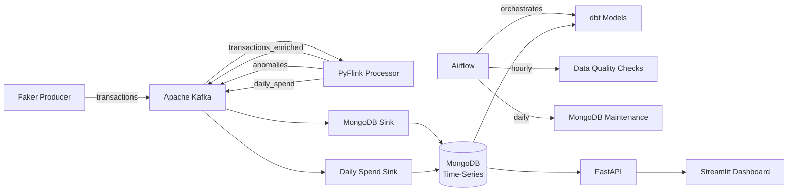

# Real-Time Customer Transaction Analytics Pipeline

A **production-grade data engineering project** that ingests synthetic e-commerce transactions at 10k+ txns/sec, runs real-time anomaly detection via Apache Flink, persists results to MongoDB time-series collections, and serves insights through a REST API and live dashboard — with scheduled batch orchestration via Airflow and dbt.

---

## Architecture


```mermaid
flowchart LR
    A[Faker Producer] -->|transactions| B[Apache Kafka]
    B --> C[PyFlink Processor]
    C -->|transactions_enriched| B
    C -->|anomalies| B
    C -->|daily_spend| B
    B --> D[MongoDB Sink]
    B --> DS[Daily Spend Sink]
    D --> E[(MongoDB\nTime-Series)]
    DS --> E
    I[Airflow] -->|orchestrates| F[dbt Models]
    I -->|hourly| J[Data Quality Checks]
    I -->|daily| K[MongoDB Maintenance]
    E --> F
    E --> G[FastAPI]
    G --> H[Streamlit Dashboard]
```

### Data Flow

1. **Producer** generates synthetic e-commerce transactions (Faker) and publishes to Kafka `transactions` topic (designed for 10k+ txns/sec).
2. **PyFlink Processor** consumes events, applies per-user tumbling-window aggregations and z-score anomaly detection (Welford's algorithm), then writes to three topics:
   - `transactions_enriched` — enriched events with running stats and z-scores.
   - `anomalies` — flagged transactions (z > 3 SD).
   - `daily_spend` — windowed per-user daily spend aggregates.
3. **MongoDB Sink** consumer upserts enriched transactions and anomalies into MongoDB time-series collections.
4. **Daily Spend Sink** consumer upserts windowed spend aggregates into a `daily_spend` collection.
5. **Airflow** orchestrates three scheduled DAGs:
   - `dbt_daily_models` — daily dbt batch run (merchant rollups, revenue models).
   - `data_quality_checks` — hourly schema/null/range/duplicate/freshness checks.
   - `mongodb_maintenance` — daily TTL purges, index health, slow-query detection.
6. **dbt** transforms raw data into 6 models (2 staging + 4 mart) with 24 built-in tests.
7. **FastAPI** exposes REST endpoints (`/users/{id}/trends`, `/anomalies`, `/merchants/top`, `/health`).
8. **Streamlit Dashboard** provides live charts: transaction volume, top merchants, anomaly alerts, spend breakdowns.

### Kafka Topics

| Topic | Partitions | Description |
|-------|-----------|-------------|
| `transactions` | 6 | Raw synthetic transactions from the producer |
| `transactions_enriched` | 6 | Enriched events with running stats and z-scores |
| `anomalies` | 3 | Flagged high-z-score transactions |
| `daily_spend` | 3 | Windowed per-user daily spend aggregates |

---

## Tech Stack

| Category | Technology | Purpose |
|----------|-----------|---------|
| **Streaming** | Apache Kafka (Confluent 7.4) | Event ingestion & topic routing |
| **Processing** | PyFlink (Apache Flink 1.18) | Stateful aggregations, z-score anomaly detection |
| **Storage** | MongoDB 7.0 (time-series) | Transactions, anomalies, daily spend persistence |
| **Orchestration** | Apache Airflow 2.8 | 3 scheduled DAGs (dbt, data quality, maintenance) |
| **Batch Analytics** | dbt-core + dbt-duckdb | 6 models: staging + mart transforms |
| **API** | FastAPI | RESTful query endpoints |
| **Dashboard** | Streamlit | Live monitoring & visualization |
| **Data Gen** | Faker | Synthetic e-commerce transactions (10 fields) |
| **Infra** | Docker Compose (14 services) | Full local orchestration |
| **Testing** | pytest (190 tests) | Unit tests across all components |
| **Languages** | Python, SQL | Core implementation |

---

## Features

- **High-throughput transaction generator** — 10k+ txns/sec with Faker:
  - Fields: `txn_id`, `user_id`, `amount`, `currency`, `timestamp`, `merchant_id`, `merchant_category`, `payment_method`, `status`, `location`
  - Idempotent via deterministic `txn_id` (SHA-256)
  - LZ4 compression, micro-batching for Kafka throughput
- **Real-time stream processing** (PyFlink):
  - Tumbling-window aggregations (daily spend per user)
  - Per-user z-score anomaly detection (Welford's online algorithm)
  - Enriched output with `user_txn_count`, `user_running_mean`, `z_score`, `is_anomaly`
  - Windowed `daily_spend` aggregates (`txn_count`, `total_spend`, `avg_spend`)
- **Two Kafka consumers**:
  - **MongoDB Sink** — upserts enriched transactions + anomalies into time-series collections
  - **Daily Spend Sink** — upserts windowed spend aggregates keyed on `(user_id, window_start)`
- **MongoDB time-series storage**:
  - Optimised time-series collections with compound and secondary indexes
  - Idempotent upserts (batch bulk writes)
- **Airflow orchestration** (3 DAGs):
  - `data_quality_checks` — hourly: schema validation, null checks, amount ranges, duplicate detection, freshness, referential integrity, status enum, location type
  - `mongodb_maintenance` — daily: TTL purges (90-day retention), orphan removal, index verification, collection compaction, slow-query detection, connection health
  - `dbt_daily_models` — daily: full dbt batch run
- **dbt batch analytics** (6 models, 24 tests):
  - Staging: `stg_transactions`, `stg_anomalies`
  - Marts: `dim_merchants`, `fct_daily_revenue`, `fct_merchant_rollup`, `fct_anomaly_summary`
- **FastAPI REST API**:
  - `/users/{id}/trends` — per-user spending trends with aggregated stats, top categories
  - `/anomalies` — recent anomaly alerts, filterable by user/z-score
  - `/merchants/top` — top merchants ranked by revenue
  - `/health` — liveness probe, `/docs` — interactive Swagger UI
  - Pydantic response models, CORS middleware
- **Streamlit Dashboard**:
  - KPI summary cards (total txns, revenue, avg amount, anomaly count)
  - Hourly transaction volume area chart
  - Top merchants by revenue (horizontal bar chart, colour-coded by category)
  - Spend breakdown by category (donut chart)
  - Transaction status distribution (donut chart)
  - Recent anomaly alerts table with z-score
  - Configurable lookback period, auto-refresh (30 s)
- **Comprehensive test suite** — 190 tests across 9 files covering producer, consumer, API, streaming, schema validation, data quality checks, MongoDB maintenance, and daily spend sink

---

## Docker Services

| Service | Port | Description |
|---------|------|-------------|
| `zookeeper` | 2181 | Kafka coordination |
| `kafka` | 9092 / 29092 | Event broker |
| `kafka-ui` | 8080 | Kafka topic browser |
| `mongo` | 27017 | MongoDB 7.0 time-series |
| `producer` | — | Faker transaction generator |
| `consumer` | — | Enriched txn + anomaly sink |
| `daily-spend-consumer` | — | Daily spend aggregate sink |
| `api` | 8000 | FastAPI REST endpoints |
| `flink-jobmanager` | 8081 (Flink UI) | Flink cluster manager |
| `flink-taskmanager` | — | Flink worker |
| `flink-job-submit` | — | Submits PyFlink job |
| `airflow-webserver` | 8081 | Airflow UI & scheduler |
| `dashboard` | 8501 | Streamlit live dashboard |

---

## Benchmarks

| Metric | Target | Status |
|--------|--------|--------|
| Producer throughput | 10k+ txns/sec | ✅ 11.7k+ txns/sec local |
| Test suite | Full coverage | ✅ 190 tests passing |

---

<details>
<summary>Project Structure</summary>

```text
.
├── .env.example                # Environment variable reference
├── docker-compose.yml          # Full local orchestration (14 services)
├── README.md
├── LICENSE
├── airflow/
│   ├── Dockerfile.airflow      # Custom Airflow image (pymongo, dbt, pyarrow)
│   └── dags/
│       ├── data_quality_checks.py   # Hourly data quality DAG (8 checks)
│       ├── dbt_daily_models.py      # Daily dbt batch run DAG
│       └── mongodb_maintenance.py   # Daily MongoDB maintenance DAG (9 tasks)
├── api/
│   ├── __init__.py
│   └── main.py                 # FastAPI application (4 endpoints)
├── config/
│   ├── db_config.yaml          # MongoDB connection settings
│   └── kafka_topics.yaml       # Kafka topic definitions (4 topics)
├── consumers/
│   ├── __init__.py
│   ├── db_sink.py              # Kafka → MongoDB sink (transactions + anomalies)
│   └── daily_spend_sink.py     # Kafka → MongoDB sink (daily spend aggregates)
├── dashboard/
│   └── app.py                  # Streamlit live dashboard
├── dbt_models/
│   └── models/
│       ├── sources.yml
│       ├── staging/
│       │   ├── schema.yml
│       │   ├── stg_transactions.sql
│       │   └── stg_anomalies.sql
│       └── marts/
│           ├── schema.yml
│           ├── dim_merchants.sql
│           ├── fct_daily_revenue.sql
│           ├── fct_merchant_rollup.sql
│           └── fct_anomaly_summary.sql
├── infra/
│   ├── Dockerfile.api          # API container
│   ├── Dockerfile.consumer     # Consumer container
│   ├── Dockerfile.dashboard    # Dashboard container
│   ├── Dockerfile.flink        # Flink job container
│   └── Dockerfile.producer     # Producer container
├── producer/
│   ├── __init__.py
│   └── producer.py             # Faker-based transaction generator
├── requirements/
│   ├── base.txt                # Shared dependencies
│   ├── producer.txt            # Producer-specific
│   ├── consumer.txt            # Consumer-specific
│   ├── api.txt                 # FastAPI dependencies
│   ├── dashboard.txt           # Streamlit dependencies
│   └── dev.txt                 # Testing & development
├── schemas/
│   ├── transaction.schema.json # Transaction JSON Schema
│   └── user.schema.json        # User JSON Schema
├── streaming/
│   ├── __init__.py
│   └── processor.py            # PyFlink stream processor
└── tests/
    ├── __init__.py
    ├── conftest.py                  # Shared fixtures & Airflow stubs
    ├── benchmark_throughput.py      # End-to-end throughput benchmark
    ├── test_producer.py             # Producer tests (23)
    ├── test_consumer.py             # DB sink consumer tests (18)
    ├── test_daily_spend_sink.py     # Daily spend sink tests (17)
    ├── test_api.py                  # FastAPI endpoint tests (17)
    ├── test_streaming.py            # Flink processor tests (22)
    ├── test_schema_validation.py    # JSON schema tests (31)
    ├── test_data_quality_checks.py  # Data quality DAG tests (34)
    └── test_mongodb_maintenance.py  # Maintenance DAG tests (25)
```

</details>

---

## Quick Start

### Prerequisites

- Docker & Docker Compose
- Python 3.9+

### 1. Configure Environment

```bash
cp .env.example .env
# Edit .env if you need to override defaults
```

### 2. Start All Services

```bash
docker compose up -d
```

This starts all 14 services: Kafka, Zookeeper, MongoDB, Kafka UI, producer, consumers, API, Flink cluster, Airflow, and the Streamlit dashboard.

### 3. Verify in Kafka UI

Open [http://localhost:8080](http://localhost:8080) → Topics → `transactions` to see messages flowing.

### 4. Open the Dashboard

Open [http://localhost:8501](http://localhost:8501) for the live monitoring dashboard.

### 5. Explore the API

Open [http://localhost:8000/docs](http://localhost:8000/docs) for interactive Swagger UI.

Endpoints: `/health`, `/users/{user_id}/trends`, `/anomalies`, `/merchants/top`.

### 6. View Airflow DAGs

Open [http://localhost:8081](http://localhost:8081) to monitor the three scheduled DAGs.

### Local Development (without Docker)

```bash
# Install all dependencies
pip install -r requirements/dev.txt

# Run the producer (1k txns/sec by default, set TARGET_TPS=10000 for full throughput)
python -m producer.producer

# Run the stream processor
python -m streaming.processor

# Run the consumers
python -m consumers.db_sink
python -m consumers.daily_spend_sink

# Run the API
uvicorn api.main:app --reload

# Run the dashboard
streamlit run dashboard/app.py
```

### Run Tests

```bash
pip install -r requirements/dev.txt
pytest
```

190 tests across 9 test files covering producer, consumers, API, streaming, schema validation, Airflow DAGs, and benchmarks.

---

## License

BSD 3-Clause — see [LICENSE](LICENSE).
